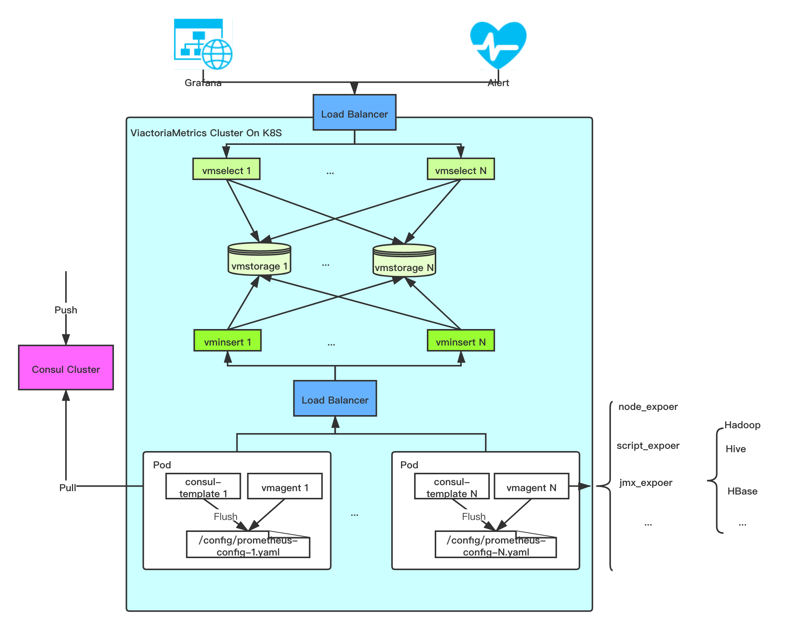

## 简介

> 整个监控平台基于K8S之上，其优点：
  1. 利用K8S本身特点提高监控平台的稳定性及可用性
  2. 降低了部署成本
  3. 结合k8s自动发现机制，可以自动采集应用的监控指标
  4. 利用Load Balancer机制达到对vmselect、vminsert负载均衡

Thanos与VictoriaMetrics(VMDB)对比
> 部署方面：均可以基于K8S部署，但VMDB部署更轻量

> 扩展方面：

> 读写方面：Thanos支持对象存储，可以利用对象存储的高可用实现数据高可用

## VictoriaMetrics组件介绍

### vmstroage
> 用于存储采集的数据

### vminsert
> 负责摄取采集的数据并利用一致性哈希算法将数据均匀的分布在可用的vmstorage实例中

### vmselect
> 查询组件，支持PromSQL语法，从vmstorage查询数据
  

    